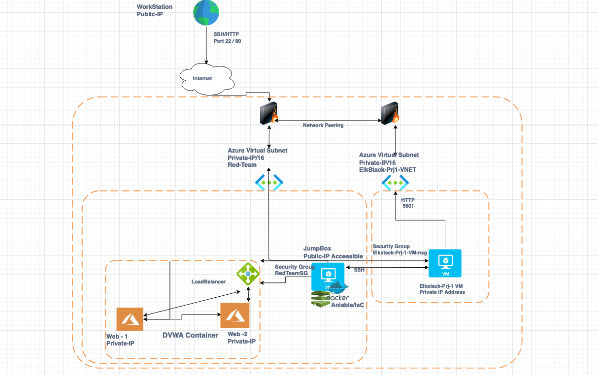

## Automated ELK Stack Deployment

The files in this repository were used to configure the network depicted below.

These files have been tested and used to generate a live ELK deployment on Azure. They can be used to either recreate the entire deployment pictured above. Alternatively, select portions of the **playbook** file may be used to install only certain pieces of it, such as Filebeat.

  - _my-playbook.yml_
  - _pentest.yml_
  - _install-elk.yml_
  - _filebeat-playbook.yml_
  - _metricbeat-playbook.yml_
  - _ansible.cfg_
  - _filebeat-config.yml_
  - _metricbeat-config.yml_
  

This document contains the following details:
- Description of the Docker-Ansible-Kibana Project
- Access Policies
- ELK Configuration
  - Beats in Use
  - Machines Being Monitored
- How to Use the Ansible Build

### Description of the Topology

The main purpose of this network is to expose a load-balanced and monitored instance of DVWA Web Application.

Load balancing ensures that the application will be highly available and accessible, in addition to restricting unauthorized users to the network.
- Load Balancing helps distribute traffic evenly across the servers and mitigates DDOS Attacks. The advantage of the Jump Box allows a secure means to offer public accessibility for the user community, then allowing those users to access through security groups for internal VM connections.

Integrating an ELK server allows users to easily monitor the vulnerable VMs for changes to the infrastrucuture, logs, administrative security and system traffic.
- _Filebeat **Collects data bout the file system**_
- _ Metricbeat records and **Collects host level metrics, including uptime**_

The configuration details of each machine may be found below.

| Name        | Function                                      | IP Address | Operating System |
|-------------|--------------------------------------|--------------|-----------------------|
| Jump Box | Gateway                                      | Public IP    | Linux                       |
| Elkstack    |  ElasticSearch Logstash Kibana |  Private IP  | Linux                       |
| Web-1       |  Web Server                                 | Private IP   | Linux                      |
| Web-2       |  Web Server                                 | Private IP   | Linux                      |

### Access Policies

The machines on the internal network are not exposed to the public Internet. 

Only the Jump Box machine can accept connections from the Internet. Access to this machine is only allowed from the following IP addresses:
- _Public IP Address_

Machines within the network can only be accessed by Jump Box and ElkStack.

We allowed access our ELK VM for the following JumpBox IP address:
- _Private_IP_
- _Public_IP_

A summary of the access policies in place can be found in the table below.

| Name        | Publicly Accessible | Allowed IP Addresses     |
|-------------|------------------------|-----------------------------|
| Jump Box | Yes                           | Private IP  Public IP |
| Web-1       |  No                           |  Private IP                       |
| Web-2       |  No                           |   Private IP                      |

### Elk Configuration

Ansible was used to automate configuration of the ELK machine. No configuration was performed manually, which is advantageous because the main advantage of  Ansible is automating configuration. Automation **Increases consistency, speed and deployment of security and application deployment**_

The playbook implements the following tasks:

- _Create Virtual Network_
- _Create a Peer Network Connection_
- _Create a new VM_
- Download and configure a container
- _Launch and expose container and implement identity and access management_

The following screenshot displays the result of running `docker ps` after successfully configuring the ELK instance.

### Target Machines & Beats
This ELK server is configured to monitor the following machines:
- _List the IP addresses of the machines you are monitoring_

| Name     | IP Addresses Monitored |
|-----------|-----------------------------|
| Web-1    | Private IP                        |
| Web-2    | Private IP                        |

We have installed the following Beats on these machines:
**The following Beats were successfully installed_**
- _filebeat_
- _metricbeat_
These Beats allow us to collect the following information from each machine:

- Filebeat monitors server logs and system logs provided detailed information regarding connections, errors encountered, etc.  

### Using the Playbook
In order to use the playbook, you will need to have an Ansible control node already configured. Assuming you have such a control node provisioned: 

SSH into the control node and follow the steps below:
- Copy the **/etc/ansible/filebeat-config.yml** file to **/etc/filebeat/filebeat.yml**. 
- Update the **filebeat-playbook.yml** file to include commands and source/destination locations. 
- Update the **filebeat-config, metricbeat-config, and hosts file to include your private ip addresses only**. 
- filebeat-config/metricbeat-config:  output.elasticsearch:  update with your private ip address 
- filebeat-config/metricbeat-config: setup.kibana: update with your private ip address only 
- hosts:  update the webservers section: private ip address ansible_python_interpreter=/usr/bin/python3 (for each web server) 
- hosts: update and create a section to discover the Elk Server just like the web servers - private ip address ansible_python_interpreter=/usr/bin/python3 
- Run the playbook, and navigate to **Web-1 and Web-2 /etc/filebeat or /etc/metricbeat** to validate a successful installation and confirm the application is working as expected. 

Answer the following questions to fill in the blanks:

- _All playbooks are formated as appname**playbook.yml** and files for execution are copied to **/etc/ansible**_
- You update these files to make Ansible run the playbook on a specific machine, **filebeat-config.yml, metricbeat-config and hosts.yml** 
- **The Elk Server is the VM that will monitor and maintain the data for logging.  The Filebeat is installed on the Web Servers, which will be monitored, the same process is executed for Metricbeat.** 

URL utilizted to navigate in order to check that the ELK server is running:
- **<public_ipaddress>:5601/app/kibana**

Provide the specific commands the user will need to run to download the playbook, update the files, etc.

- hosts
- ansible-playbook filebeat-playbook.yml
- filebeat-config.yml
- ansible-playbook metricbeat-playbook.yml
- metricbeat-config.yml
- curl https://gist.githubusercontent.com/slape/58541585cc1886d2e26cd8be557ce04c/raw/0ce2c7e744c54513616966affb5e9d96f5e12f73/metricbeat > /etc/ansible/metricbeat-config.yml
- curl https://gist.githubusercontent.com/slape/5cc350109583af6cbe577bbcc0710c93/raw/eca603b72586fbe148c11f9c87bf96a63cb25760/Filebeat > /etc/ansible/filebeat-config.yml

Steps To Create a Standard Container:

1.  ssh -i  ~/.ssh/id_rsa azureuser@13.68.185.189
2.  sudo -l
3   sudo docker container list -a
4.  sudo docker start 403d
5.  sudo docker ps
6.  sudo docker attach 403d
7.  cd /etc/anisble
8.  nano /etc/ansible/hosts
9.  nano /etc/ansible/ansible.cfg
10.  ansible all -m ping
11.  ansible-playbook my-playbook.yml
12.  nano /etc/ansible/pentest.yml
13.  ansible-playbook pentest.yml
14.  nano /etc/ansible/pentest.yml
15.  ansible-playbook pentest.yml

-	Validate with your curl command

Filebeat same process as above with the execption of executing the curl command below to download filebeat-config-.yml and microbeat-config.yml

16.  curl https://gist.githubusercontent.com/slape/5cc350109583af6cbe577bbcc0710c93/raw/eca603b72586fbe148c11f9c87bf96a63cb25760/Filebeat > /etc/ansible/filebeat-config.yml
17.  ansible-playbook filebeat-playbook.yml
18.  curl https://gist.githubusercontent.com/slape/58541585cc1886d2e26cd8be557ce04c/raw/0ce2c7e744c54513616966affb5e9d96f5e12f73/metricbeat > /etc/ansible/metricbeat-config.yml
19.  ansible-playbook metricbeat-playbook.yml

**All Configuration Files located here**
- Project-1-Azure Kibana/ansible)

